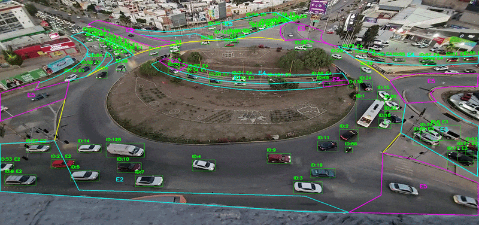

##Sistema de Análisis de Flujo Vehicular con Inteligencia Artificial (YOLOv8)

Este repositorio contiene una arquitectura automatizada de visión por computadora diseñada para el conteo, clasificación y análisis direccional de tráfico vehicular. 

A diferencia de los contadores de pantalla tradicionales, este sistema no solo detecta objetos, sino que **reconstruye trayectorias completas**, determinando el origen y destino exacto de cada vehículo dentro de una red vial compleja (específicamente en glorietas). Está diseñado para extraer datos crudos escalables para la toma de decisiones en ingeniería de tránsito.

  

---

##Estructura del Repositorio

El proyecto está modularizado en cuatro directorios principales para facilitar su comprensión, ejecución y análisis empírico:

* **`/src` (Código Fuente):** Contiene el núcleo computacional. Aquí reside `PROYECTO-YOLO-GLORIETA.py`, el script principal de Python que procesa los videos, ejecuta el modelo de detección y extrae las métricas de flujo.
* **`/sumo` (Simulación Macroscópica):** Integra el entorno SUMO (Simulation of Urban MObility). Este software recibe el mapa físico modelado de la intersección (esquema-glorieta.net.xml) y le inyecta las trayectorias vehiculares extraídas (rutas-reales.rou.xml). A través del archivo de configuración (osm.sumocfg), se ejecuta la simulación que da como resultado un archivo de salida (rutas-sumo.xml basado en tripinfo), del cual se obtienen los tiempos exactos de recorrido, velocidades y demoras de cada vehículo.
* **`/docs` (Documentación del Estudio):** Alberga la justificación académica e ingenieril del caso empírico. Incluye el documento de análisis descriptivo (`GlorietaComparación.pdf`) y una presentación gráfica de los resultados (`Poster-Glorieta.jpg`).
* **`/data` (Muestras Visuales):** Contiene las salidas renderizadas por el sistema tras el procesamiento de inferencia (`Video-Procesado.mp4` y su versión `.gif`), sirviendo como demostración del *tracking* en tiempo real.

---

##Características Principales
* **Tracking Direccional Avanzado:** Seguimiento continuo de vehículos asignando un ID único desde su punto de inserción hasta su salida de la intersección.
* **Corrección de Perspectiva (Interpolación Aérea):** Transforma la visión inclinada de cámaras de vigilancia convencionales a un plano superior (cenital) utilizando referencias satelitales (ej. Google Earth), permitiendo predecir trayectorias con precisión geométrica.
* **Procesamiento de Alto Volumen:** Arquitectura optimizada para ingestar grabaciones de 24 horas continuas, superando las limitaciones de memoria al segmentar y analizar flujos de video bajo diferentes condiciones de iluminación (diurnas y nocturnas).
* **Gemelo Digital y Simulación (SUMO):** Capacidad para trasladar los datos extraídos por YOLO a un entorno de simulación virtual. El sistema genera escenarios donde los vehículos navegan un mapa predefinido siguiendo las rutas empíricas. Al finalizar, el software arroja métricas precisas estructuradas en XML (tiempos de viaje, tiempos de espera), permitiendo validar rediseños viales y justificar la toma de decisiones sin afectar la infraestructura real.
---

## Estudio de Caso Real y Validación (Prueba de 24 Horas)

Para validar la robustez del sistema en un entorno empírico, tomamos un caso real, más específicamente una de las intersecciones más complejas de San Luis Potosí. Se realizó una grabación de 24 horas de la intersección y posteriormente se evaluó el comportamiento del tráfico real.

### Hallazgos del Reporte Analítico
El procesamiento de los datos estructurados arrojó las siguientes métricas clave de la intersección:
1. **Identificación de Horas Pico:** Se aislaron visual y estadísticamente las ventanas de máxima saturación vial, correlacionadas directamente con los horarios de entrada/salida laboral y escolar.
2. **Mapeo de Cuellos de Botella:** Al analizar los tiempos de recorrido de los vehículos (diferencia entre el *timestamp* de entrada y salida), se localizaron los nodos exactos donde el flujo pierde velocidad crítica.
3. **Comportamiento por Carril:** El sistema logró clasificar qué accesos aportan la mayor carga vehicular y cuáles salidas presentan saturación por falta de optimización.

### Propuestas de Mejora Vial (Escalabilidad del Sistema)
Con base en la información extraída y modelada por esta herramienta, se pueden justificar propuestas de infraestructura empíricas, tales como:
* **Rediseño de Geometría Vial:** Modificación de radios de giro y delimitación de carriles de aceleración/desaceleración en los accesos más saturados.
* **Implementación de Semáforos Inteligentes:** Uso de los datos volumétricos para calibrar los ciclos de semaforización en los nodos adyacentes a la glorieta.
* **Reingeniería de Flujos:** Prohibición de ciertas maniobras de entrecruzamiento que el sistema identificó como causantes de las caídas de velocidad.

> **Nota:** Aunque este reporte se basa en una glorieta específica de San Luis Potosí, la lógica de regiones de interés basada en coordenadas de píxeles permite que **este código sea desplegado en cualquier otra intersección o ciudad** ajustando únicamente el mapa base.

---

## Arquitectura del Sistema y Lógica de Rastreo

Para lograr el rastreo direccional sin depender de hardware de radar, el algoritmo emplea un enfoque geométrico basado en el lienzo del video:

1. **Plano Cenital y Corrección:** Se extrae un frame base de la intersección y se le aplica la corrección de perspectiva. Este mapa estático es el lienzo de trabajo.
2. **Regiones de Interés Dinámicas:** Sobre el lienzo, se mapean polígonos utilizando arreglos de coordenadas `(X, Y)`. Cada polígono representa físicamente un carril de entrada o de salida.
3. **Lógica de Cruce de Polígonos:** Cuando YOLOv8 detecta un automóvil, se calcula el centro geométrico (centroide) de su *bounding box*. Si el vehículo con el ID `#104` cruza las coordenadas del arreglo `Entrada_Norte` y posteriormente las del arreglo `Salida_Sur`, el sistema consolida el viaje y lo registra en la matriz de flujo.

---

## Requisitos Técnicos y Entorno

Para garantizar un procesamiento eficiente (especialmente para la inferencia rápida del modelo de Deep Learning en videos prolongados), se requiere:

* **Hardware:** Se recomienda fuertemente una GPU compatible con tecnología CUDA (ej. serie NVIDIA RTX) para la aceleración por hardware de YOLOv8.
* **Entorno:** Python 3.8 o superior y SUMO (versión más reciente recomendada para simulación).

### Dependencias Principales
* `ultralytics`: Inferencia y tracking oficial del modelo YOLOv8.
* `opencv-python (cv2)`: Procesamiento de frames, lectura de video, dibujo matemático de polígonos y renderizado visual.
* `numpy`: Manejo de matrices de píxeles y operaciones vectoriales para las coordenadas de las ROIs.
* `pandas`: Estructuración, limpieza y exportación del flujo de datos.

---

## Configuración y Uso

El sistema está diseñado para ser altamente parametrizable. Antes de ejecutar el script principal (`src/PROYECTO-YOLO-GLORIETA.py`), ajusta las variables de entorno en la sección de constantes:

* `CONFIDENCE_THRESHOLD`: (Ej. `0.5`). Define la sensibilidad de la red neuronal. Un valor más alto reduce los falsos positivos bajo condiciones de poca luz.
* `POLIGONOS_ENTRADA` / `POLIGONOS_SALIDA`: Arreglos de NumPy con las coordenadas `[x, y]`. Deben recalibrarse si se procesa un video con una perspectiva de cámara distinta.
* **Rutas Relativas:** Asegúrate de que las variables apunten correctamente a tus videos base.

Para visualizar la simulación, simplemente abre el archivo `sumo/osm.sumocfg` desde la interfaz gráfica de SUMO (SUMO-GUI).

---

