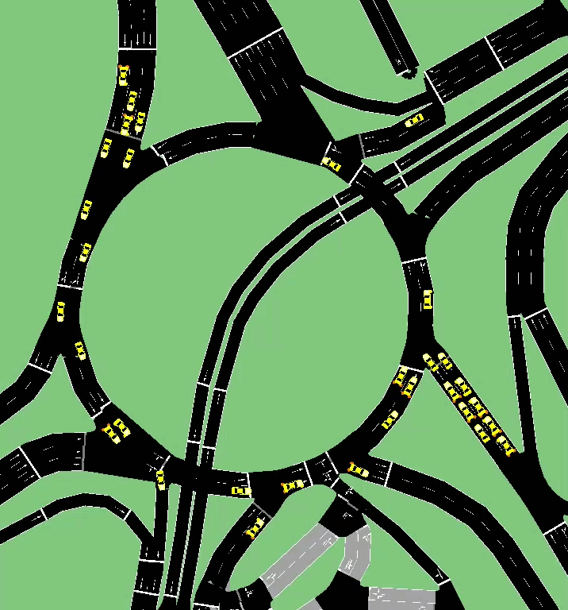

# AI-Powered Vehicular Traffic Flow Analysis System (YOLOv8)

This repository contains an automated computer vision architecture designed for counting, classifying, and directionally analyzing vehicular traffic. 

Unlike traditional on-screen counters, this system not only detects objects but also **reconstructs complete trajectories**, determining the exact origin and destination of each vehicle within a complex road network (specifically roundabouts). It is designed to extract scalable raw data for decision-making in traffic engineering.

  

---

## Repository Structure

The project is modularized into four main directories to facilitate its understanding, execution, and empirical analysis:

* **`/src` (Source Code):** Contains the computational core. Here resides `PROYECTO-YOLO-GLORIETA.py`, the main Python script that processes the videos, executes the detection model, and extracts the flow metrics.
* **`/sumo` (Macroscopic Simulation):** Integrates the SUMO (Simulation of Urban MObility) environment. This software receives the modeled physical map of the intersection (`esquema-glorieta.net.xml`) and injects the extracted vehicular trajectories (`rutas-reales.rou.xml`). Through the configuration file (`osm.sumocfg`), the simulation is executed, resulting in an output file (`rutas-sumo.xml` based on tripinfo), from which the exact travel times, speeds, and delays of each vehicle are obtained.
* **`/docs` (Study Documentation):** Houses the academic and engineering justification of the empirical case. It includes the descriptive analysis document (`GlorietaComparación.pdf`) and a graphical presentation of the results (`Poster-Glorieta.jpg`).
* **`/data` (Visual Samples):** Contains the rendered outputs from the system after inference processing (`Video-Procesado.mp4` and its `.gif` version), serving as a real-time tracking demonstration.

---

## Main Features
* **Advanced Directional Tracking:** Continuous vehicle tracking by assigning a unique ID from their insertion point until their exit from the intersection.
* **Perspective Correction (Aerial Interpolation):** Transforms the tilted view of conventional surveillance cameras to a top-down (zenithal) plane using satellite references (e.g., Google Earth), allowing trajectory prediction with geometric precision.
* **High-Volume Processing:** Optimized architecture for ingesting 24-hour continuous recordings, overcoming memory limitations by segmenting and analyzing video streams under different lighting conditions (daytime and nighttime).
* **Digital Twin and Simulation (SUMO):** Capability to transfer the data extracted by YOLO into a virtual simulation environment. The system generates scenarios where vehicles navigate a predefined map following empirical routes. Upon completion, the software outputs precise metrics structured in XML (travel times, wait times), allowing the validation of road redesigns and justifying decision-making without affecting real infrastructure.

  

---

## Real Case Study and Validation (24-Hour Test)

To validate the system's robustness in an empirical environment, we took a real case, specifically one of the most complex intersections in San Luis Potosí. A 24-hour recording of the intersection was conducted, and the real traffic behavior was subsequently evaluated.

### Analytical Report Findings
The processing of the structured data yielded the following key metrics for the intersection:
1. **Peak Hour Identification:** The windows of maximum road saturation were visually and statistically isolated, directly correlated with work and school commute times.
2. **Bottleneck Mapping:** By analyzing vehicle travel times (the difference between the entry and exit *timestamp*), the exact nodes where the flow loses critical speed were located.
3. **Lane Behavior:** The system successfully classified which entrances contribute the highest vehicular load and which exits present saturation due to a lack of optimization.

### Road Improvement Proposals (System Scalability)
Based on the information extracted and modeled by this tool, empirical infrastructure proposals can be justified, such as:
* **Road Geometry Redesign:** Modification of turning radii and delimitation of acceleration/deceleration lanes at the most saturated entrances.
* **Smart Traffic Light Implementation:** Use of volumetric data to calibrate traffic light cycles at adjacent nodes to the roundabout.
* **Flow Reengineering:** Prohibition of certain weaving maneuvers that the system identified as causing speed drops.

> **Note:** Although this report is based on a specific roundabout in San Luis Potosí, the region of interest logic based on pixel coordinates allows **this code to be deployed in any other intersection or city** by adjusting only the base map.

---

## System Architecture and Tracking Logic

To achieve directional tracking without relying on radar hardware, the algorithm employs a geometric approach based on the video canvas:

1. **Zenithal Plane and Correction:** A base frame is extracted from the intersection and perspective correction is applied. This static map serves as the working canvas.
2. **Dynamic Regions of Interest (ROIs):** On the canvas, polygons are mapped using `(X, Y)` coordinate arrays. Each polygon physically represents an entrance or exit lane.
3. **Polygon Crossing Logic:** When YOLOv8 detects a car, the geometric center (centroid) of its *bounding box* is calculated. If the vehicle with ID `#104` crosses the coordinates of the `Entrada_Norte` array and subsequently the `Salida_Sur` array, the system consolidates the trip and logs it in the flow matrix.

---

## Technical Requirements and Environment

To ensure efficient processing (especially for fast inference of the Deep Learning model on prolonged videos), the following is required:

* **Hardware:** A CUDA-compatible GPU (e.g., NVIDIA RTX series) is strongly recommended for hardware acceleration of YOLOv8.
* **Environment:** Python 3.8 or higher, and SUMO (latest version recommended for simulation).

### Main Dependencies
* `ultralytics`: Official inference and tracking for the YOLOv8 model.
* `opencv-python (cv2)`: Frame processing, video reading, mathematical polygon drawing, and visual rendering.
* `numpy`: Pixel matrix handling and vector operations for the ROI coordinates.
* `pandas`: Data flow structuring, cleaning, and exporting.

---

## Configuration and Usage

The system is designed to be highly customizable. Before running the main script (`src/PROYECTO-YOLO-GLORIETA.py`), adjust the environment variables in the constants section:

* `CONFIDENCE_THRESHOLD`: (e.g., `0.5`). Defines the sensitivity of the neural network. A higher value reduces false positives under low-light conditions.
* `POLIGONOS_ENTRADA` / `POLIGONOS_SALIDA`: NumPy arrays with the `[x, y]` coordinates. They must be recalibrated if processing a video with a different camera perspective.
* **Relative Paths:** Ensure that the variables point correctly to your base videos.

To visualize the simulation, simply open the `sumo/osm.sumocfg` file from the SUMO graphical interface (SUMO-GUI).
